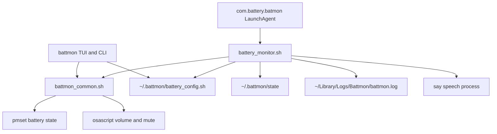

# Battmon Technical Reference

Battmon is a macOS LaunchAgent and terminal manager. The implementation targets the system Bash 3.2 runtime and built-in macOS commands only.

## Architecture



### Files

- `battmon`: interactive manager, service controls, diagnostics, and config editing.
- `battery_monitor.sh`: one evaluation cycle plus interruptible speech.
- `battmon_common.sh`: shared config, battery, audio, formatting, and logging functions.
- `battery_config.sh`: portable seed/default configuration. It is not a live mirror.
- `setup.sh`: safe install, migration, service registration, and uninstall.
- `com.battery.batmon.plist`: distribution template; setup generates the user-specific plist.
- `tests/`: deterministic command stubs and regression tests.

## Configuration ownership

`~/.battmon/battery_config.sh` is the only writable source of truth. The Desktop/package copy is a seed for a first install and is never silently synchronized back from the active config.

The manager records a checksum when loading the config. Before saving, it takes a lock and compares the current checksum with the loaded checksum. If another manager wrote a newer version, the stale save is rejected. Writes use a temporary file in the runtime directory followed by an atomic rename.

Generated alert values use Bash `%q` escaping, so quotes, command substitutions, backticks, spaces, and backslashes remain literal message text.

```text
LEVEL:TYPE:REPEAT_COUNT:PAUSE_DELAY_MS:MESSAGE
```

- Level: 1–100
- Type: `LOW` or `HIGH`
- Repeats: 1–100
- Pause: 50–60,000 ms; default 100 ms
- Message: non-empty text; `{percent}`, `{level}`, and `{pct}` interpolate live battery percentage

Invalid numeric fields and malformed rules are rejected or replaced by safe defaults. Duplicate level/type rules are normalized into one ordered combined message, preventing unreachable duplicate rules.

## Battery model

Battery source and battery activity are deliberately separate:

- Source: `AC`, `BATTERY`, or `UNKNOWN`
- Mode: `charging`, `charged`, `discharging`, or `unknown`

This matters because macOS can report AC power while the battery is still discharging. `LOW` rules use actual discharging mode. `HIGH` rules use charging/charged mode. The TUI reports this state explicitly instead of calling every AC-powered state “charging.”

Trigger selection supports:

1. Exact threshold arrival.
2. Inclusive threshold crossing between LaunchAgent runs.
3. A transition into charging or discharging while already beyond a threshold.
4. Large jumps across several thresholds. LOW selects the lowest crossed configured threshold; HIGH selects the highest crossed threshold.

Only the selected rule is announced. State is persisted before speech begins so overlapping manual/LaunchAgent checks cannot repeat the same alert.

## State and locks

State is atomically stored in `~/.battmon/state`:

```text
LAST_PERCENT=13
LAST_ALERT_LEVEL=13
LAST_ALERT_TYPE=LOW
LAST_MODE=discharging
LAST_SOURCE=BATTERY
```

The monitor lock and configuration lock live under the owner-only `~/.battmon` directory. Stale locks are reclaimed only when their recorded process is no longer the corresponding Battmon process.

## Interruptible speech

Speech runs asynchronously. While `say` is active, the monitor polls battery and audio state at `CHECK_INTERVAL_MS` (default 200 ms). Pause polling uses the smaller of the configured pause and check interval, so a 50 ms pause stays interruptible without rounding to zero.

Cutoffs include:

- Charger source transition during an alert.
- Battery changing from discharging to charging/charged.
- HIGH alert losing AC or beginning to discharge.
- Hardware Mute.
- Any deliberate Volume Down change below the active alert volume.
- `INT`, `TERM`, or `HUP` signals.

Signal handlers exit with conventional status codes. The EXIT cleanup stops the speech child, restores audio unless the user deliberately changed it, and releases the monitor lock.

If the original audio state cannot be read, Battmon speaks without changing volume. It never invents a fallback volume that could later overwrite the user's real setting.

## Installation lifecycle

`setup.sh` performs these steps:

1. Verify macOS and required built-in commands.
2. Syntax-check every installed shell file.
3. Refuse to overwrite an unrelated `~/.local/bin/battmon` command.
4. Back up the active configuration.
5. Atomically deploy the CLI, engine, and common library.
6. Migrate/normalize the active config.
7. Remove only legacy aliases that still point to Battmon.
8. Generate and validate the LaunchAgent.
9. Load and verify the service, unless `--no-start` was requested.

The installer never calls Homebrew and never changes shell startup files. Uninstall removes only verified Battmon-owned command links. Configuration is preserved unless `--purge` is explicitly supplied, and purge first creates a backup.

## Logs and diagnostics

Logs are private to the user under `~/Library/Logs/Battmon`. At 1 MiB, the current log is rotated to `battmon.log.1`.

`battmon doctor` is read-only and checks:

- Platform and built-in commands
- Configuration syntax and normalization
- Battery parsing
- Audio-state access
- LaunchAgent plist validity
- Current service status

`battmon --help`, `battmon status`, and `battmon doctor` do not create or synchronize configuration files.

## Tests

Run:

```bash
./tests/run_tests.sh
```

The suite prepends deterministic stubs for `pmset`, `osascript`, `say`, `sleep`, and `launchctl`. It does not speak, change volume, or load a real service. Covered workflows include exact triggers, debounce, multi-threshold jumps, AC-attached discharging, charging suppression, duplicate normalization, shell-safe messages, stale-manager collision rejection, read-only help, unknown commands, and no-start installation.
