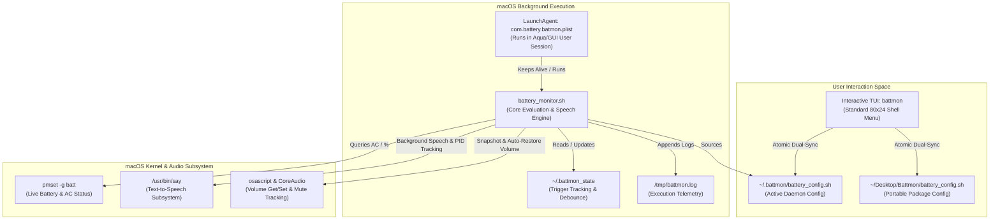

# 🦇 Battmon: Deep-Dive Developer Reference & Architecture Manual

**Battmon** is an automated battery voice-alert daemon and Terminal User Interface (TUI) for macOS. It pairs a low-latency, interruptible background monitoring engine with an interactive terminal manager designed specifically for standard 80×24 macOS terminal windows.

---

## 1. System Topology & Architecture



### Core File Manifest
*   [`battery_monitor.sh`](file:///Users/app/Desktop/Battmon/battery_monitor.sh): The background daemon engine. Executes the battery evaluation loop, audio state snapshotting, interruptible speech synthesis, sub-100ms pause polling, and volume restoration.
*   [`battmon`](file:///Users/app/Desktop/Battmon/battmon): The interactive TUI and command-line entry point. Handles input validation, alert rule management, batch timing updates, duplicate detection, and process control.
*   [`battery_config.sh`](file:///Users/app/Desktop/Battmon/battery_config.sh): Configuration file containing timing parameters, volume settings, and the `ALERTS` array (`LEVEL:TYPE:REPEAT:DELAY:MESSAGE`).
*   [`setup.sh`](file:///Users/app/Desktop/Battmon/setup.sh): Installation script handling LaunchAgent registration, backup preservation, and symlink creation (`~/.local/bin/battmon`).
*   [`com.battery.batmon.plist`](file:///Users/app/Desktop/Battmon/com.battery.batmon.plist): macOS Launchd service definition executed within the user Aqua session.

---

## 2. Chronological Analysis: Problems & Implementations

### Prompt 1: Batch Timing Settings & "Apply to Existing Rules"
*   **Problem Statement**: Changing the global repeat count and pause delay in Option 5 only altered future default fallbacks; existing configured alerts retained their individually baked repeat and delay values.
*   **Root Cause**: In `battery_config.sh`, each alert tuple contains explicit repeat and delay fields:
    ```bash
    "100:HIGH:10:500:Battery is fully charged"
    ```
    Updating global variables `$REPEAT_COUNT` and `$REPEAT_DELAY_MS` did not modify elements inside the `ALERTS` array.
*   **Implementation**:
    1. Added Option 6: `Apply to existing rules` in [`battmon`](file:///Users/app/Desktop/Battmon/battmon#L555-L596).
    2. Implemented `apply_timing_to_existing_rules()`: Prompts the user for a new repeat count and pause delay (or defaults to current global values), updates global `$REPEAT_COUNT` and `$REPEAT_DELAY_MS`, and iterates across all existing elements in `ALERTS`:
       ```bash
       local updated=()
       for alert in "${ALERTS[@]}"; do
           parse_alert_entry "$alert"
           updated+=("${PARSED_LVL}:${PARSED_TYP}:${new_rep}:${new_del}:${PARSED_MSG}")
       done
       ALERTS=("${updated[@]}")
       save_config
       ```

---

### Prompts 2, 3, 4: Alert Persistence, Reinstallation Overwrite, & Dual-Location Desync
*   **Problem Statement**: Custom alerts added by the user (such as a rule for 25%) disappeared when listing alerts, after reinstalls, or when invoking `battmon` from different paths.
*   **Root Causes**:
    1. **Multi-Location Desync**: `battmon` lived in `~/Desktop/Battmon/` while the LaunchAgent runtime daemon executed from `~/.battmon/`. Writing changes to one directory did not update the other.
    2. **Reinstallation Overwrites**: Running `./setup.sh` copied the repository's clean template configuration over `~/.battmon/battery_config.sh`, wiping user customizations.
    3. **Uninstallation Purge**: Running `./setup.sh --uninstall` wiped `~/.battmon/` without archiving existing user rules back into the workspace/installer folder.
    4. **TUI Preview Capping**: The main menu preview originally displayed only the first 4 alerts, giving the false impression that rules beyond the 4th index were lost.
*   **Implementation**:
    1. **Bidirectional Dual-Sync (`save_config` & `load_config`)**:
       [`save_config`](file:///Users/app/Desktop/Battmon/battmon#L104-L153) now writes atomically via `mktemp` to **all** active paths: `~/.battmon/battery_config.sh`, `$SCRIPT_DIR/battery_config.sh`, and explicit `$HOME/Desktop/Battmon/battery_config.sh`.
       [`load_config`](file:///Users/app/Desktop/Battmon/battmon#L53-L84) inspects file modification timestamps (`-nt` operator) across paths so the newest edits always propagate everywhere.
    2. **Installer Preservation in [`setup.sh`](file:///Users/app/Desktop/Battmon/setup.sh)**:
       Before deploying, `setup.sh` checks if `~/.battmon/battery_config.sh` exists and contains custom alerts. If present, it syncs those rules rather than overwriting with default templates. On uninstall, it creates a backup copy in the installer directory.
    3. **Symlink Canonicalization**:
       Implemented recursive `readlink` loop in `battmon` header to resolve the physical script location when invoked through `~/.local/bin/battmon`.
    4. **Expanded 6-Alert Menu Preview**:
       Expanded the main dashboard to render 6 alerts simultaneously with an overflow indicator (`... and N more alerts - view all via option 4`) within the strict 20-row budget.

---

### Prompt 6: Premature Speech Cutoff (39% Alert Stopped Early)
*   **Problem Statement**: During an alert set for 39% battery (configured for 10 repeats), the speech alert triggered a few times and then abruptly died before reaching 10 iterations.
*   **Root Cause**:
    1. In `battery_monitor.sh`, the loop checked battery status and power source after every repetition. As speech was synthesized, the system battery drained from 39% down to 38%.
    2. The loop condition previously asserted: `[ "$cur_level" -eq "$target_level" ]`. When the battery dipped to 38%, the equality check failed, causing the loop to terminate prematurely.
    3. The loop was not accounting for low-battery discharge direction (for `LOW` alerts, battery draining further below the threshold is still an active alert condition).
*   **Implementation**:
    1. Rewrote the condition check in [`battery_monitor.sh`](file:///Users/app/Desktop/Battmon/battery_monitor.sh#L190-L245):
       - A `LOW` alert remains valid as long as battery is `cur_level <= target_level` and AC charger remains disconnected.
       - A `HIGH` alert remains valid as long as battery is `cur_level >= target_level` and AC charger remains connected.
    2. Added real-time AC interrupt detection: Immediate cutoff occurs only if the user plugs in the charger (for `LOW`) or unplugs the charger (for `HIGH`).

---

### Prompts 7 & 8: Duplicate Detection & Fixed-Percentage Alert Editing
*   **Problem Statement**:
    - Adding an alert with a percentage that already existed created duplicate or conflicting rules.
    - Editing an existing alert prompted the user to change the percentage, which risked collisions and caused confusion.
*   **Implementation**:
    1. **Duplicate Detection in [`add_alert`](file:///Users/app/Desktop/Battmon/battmon#L407-L460)**:
       When a percentage is entered, `battmon` scans the `ALERTS` array. If an alert already exists for that percentage, it displays a conflict dialog showing the existing alert's type, spoken message, repeat count, and pause delay.
       It offers four choices:
       `1) Edit this existing alert` | `2) Overwrite with new settings` | `3) Choose a different percentage` | `4) Cancel`
    2. **Fixed-Key Editing in [`edit_alert_at_index`](file:///Users/app/Desktop/Battmon/battmon#L330-L370)**:
       The percentage is permanently locked (`Percentage: XX% (Fixed)`). The edit flow prompts only for mutable properties:
       `1. Trigger condition` $\rightarrow$ `2. Spoken message` $\rightarrow$ `3. Repeat count` $\rightarrow$ `4. Pause delay`.

---

### Prompts 9 & 10: Minimum 50ms Delay & 100ms Default Delay
*   **Problem Statement**:
    - The lower bound on pause delay was previously restricted to 100 ms or 500 ms.
    - Even after changing defaults, pressing Enter during alert creation continued to default to 500 ms.
*   **Root Cause**:
    - Validation functions: `prompt_number` had hardcoded minimum boundaries of `100` or `500`.
    - Fallback expansions: Scripts contained `${REPEAT_DELAY_MS:-500}` fallbacks in `battmon`, `battery_monitor.sh`, and `reset_defaults`.
    - In macOS Bash, `sleep` sub-second operations require decimal notation (`sleep 0.050`), and dividing integer milliseconds by check intervals produced rounding artifacts.
*   **Implementation**:
    1. **Bound Reduction**: Set minimum validation bound to `50` (`prompt_number ... 50 60000`) across all input prompts.
    2. **100 ms Enter Default**: Updated all fallback expansions to `${REPEAT_DELAY_MS:-100}` and initial config assignments to `REPEAT_DELAY_MS=100`.
    3. **Sub-100ms Polling Loop**: In [`battery_monitor.sh`](file:///Users/app/Desktop/Battmon/battery_monitor.sh#L230-L245), dynamic sub-second pause loop uses floating-point division through `awk` and clamps poll increments to `0.050s` when delay is set to 50ms.

---

## 3. Deep-Dive Technical Mechanics

### 3.1 Interruptible Speech Loop & Asynchronous PID Polling
Standard text-to-speech tools block execution until the audio completes. If an alert repeats 20 times, blocking calls would make the daemon unresponsive to hardware mute buttons or charger state changes for 30–60 seconds.

`battery_monitor.sh` uses asynchronous process forking and high-frequency polling:

```bash
# 1. Spawn speech in background and capture Process ID
say "$speak_text" &
say_pid=$!

# 2. Poll every 200ms while speech process is alive
while kill -0 "$say_pid" 2>/dev/null; do
    # Check if charger was connected/disconnected
    if check_silenced "$target_type"; then
        kill "$say_pid" 2>/dev/null
        wait "$say_pid" 2>/dev/null
        return 1
    fi
    # Check if user pressed Mute (F10) or Volume Down (F11)
    if check_user_silenced_audio; then
        kill "$say_pid" 2>/dev/null
        wait "$say_pid" 2>/dev/null
        return 1
    fi
    sleep 0.2
done
wait "$say_pid" 2>/dev/null
```

### 3.2 Hardware Key Interruption (Mute & Volume Down)
macOS media keys adjust system output volume directly in hardware/CoreAudio. `battery_monitor.sh` detects silencing actions without requiring root event taps:

```bash
check_user_silenced_audio() {
    local cur_vol_settings
    cur_vol_settings=$(get_audio_settings)
    local cur_vol cur_muted
    cur_vol=$(echo "$cur_vol_settings" | awk '{print $1}')
    cur_muted=$(echo "$cur_vol_settings" | awk '{print $2}')

    # 1. User pressed hardware MUTE (F10)
    if [ "$cur_muted" = "true" ] && [ "$ORIG_MUTED" != "true" ]; then
        return 0
    fi

    # 2. User pressed VOLUME DOWN (F11)
    if [ -n "$ACTIVE_ALERT_VOL" ] && [ -n "$cur_vol" ]; then
        if [ "$cur_vol" -lt "$ACTIVE_ALERT_VOL" ]; then
            return 0
        fi
    fi
    return 1
}
```

### 3.3 Atomic Audio Snapshot & Restoration Engine
Alerts temporarily boost volume to `ALERT_VOLUME` (default 60%). The engine guarantees that the user's previous volume and mute status are restored when the alert finishes, when interrupted, or if the process is killed:

```bash
# Snapshot original volume and mute state
save_original_audio() {
    local settings
    settings=$(get_audio_settings)
    ORIG_VOL=$(echo "$settings" | awk '{print $1}')
    ORIG_MUTED=$(echo "$settings" | awk '{print $2}')
    VOL_MODIFIED=0
}

# Restores state on EXIT, INT, or TERM
restore_audio() {
    if [ "$RESTORE_VOLUME" = true ] && [ "$VOL_MODIFIED" -eq 1 ]; then
        if [ -n "$ORIG_VOL" ]; then
            if [ "$ORIG_MUTED" = "true" ]; then
                osascript -e "set volume output volume $ORIG_VOL with output muted" 2>/dev/null || true
            else
                osascript -e "set volume output volume $ORIG_VOL without output muted" 2>/dev/null || true
            fi
        fi
        VOL_MODIFIED=0
    fi
}
trap restore_audio EXIT INT TERM
```

### 3.4 Live Dynamic Percentage Interpolation
If battery drains during speech playback (e.g. alert started at 15%, but discharges to 14% on repeat 4), speaking "15 percent" becomes incorrect. The engine interpolates the live battery reading dynamically into the spoken message:

```bash
# Query real-time battery level
cur_batt_pct=$(pmset -g batt | grep -Eo "\b[0-9]+%" | tr -d '%' | head -n 1)

# Dynamically substitute any percentage in default messages
if [[ "$ALERT_MSG" =~ Battery\ is\ at\ [0-9]+\ percent ]]; then
    speak_text="Battery is at ${cur_batt_pct} percent"
else
    speak_text="$ALERT_MSG"
fi
```

### 3.5 High-Resolution Sub-100ms Pauses
Standard Bash `sleep` implementations on macOS accept floating point numbers, but integer arithmetic in Bash discards decimal fractions. The engine calculates sub-second polling delays via `awk`:

```bash
# Convert integer milliseconds to fractional seconds
pause_sec=$(awk -v ms="$ALERT_DELAY" 'BEGIN { printf "%.3f", ms / 1000 }')
pause_poll_ms=100
if [ "$ALERT_DELAY" -le 100 ]; then
    pause_poll_ms="$ALERT_DELAY"
fi
poll_sec=$(awk -v ms="$pause_poll_ms" 'BEGIN { printf "%.3f", ms / 1000 }')

# Interruptible sub-second loop
elapsed=0
while [ "$elapsed" -lt "$ALERT_DELAY" ]; do
    if check_silenced "$target_type" || check_user_silenced_audio; then
        return 1
    fi
    sleep "$poll_sec"
    elapsed=$((elapsed + pause_poll_ms))
done
```

### 3.6 Standard 80×24 Terminal Matrix Design
The macOS terminal default geometry is 80 columns by 24 rows. Running interactive menus that exceed these dimensions triggers vertical scrolling or word wrapping, breaking the interface layout.

`battmon` enforces rigid constraints:
*   **Vertical Budget**: Exactly **20 lines total** (leaves 4 buffer lines for terminal title bars and prompts).
*   **Horizontal Budget**: Exactly **74 characters**, guaranteed inside 80 columns.
*   **Preview Window**: Maximum **6 alert rules** displayed in the table. If more exist, an overflow indicator renders without expanding vertical height:
    ```text
    • 100% [HIGH] 20x  100ms "Battery is fully charged"
    •  80% [HIGH] 20x  100ms "The battery is optimally charged"
    •  39% [LOW ] 20x  100ms "Battery is at 39 percent"
    •  15% [LOW ] 20x  100ms "Battery is at 15 percent"
    •  13% [LOW ] 20x   50ms "Battery is at 13 percent"
    •  10% [LOW ] 20x  100ms "Battery is at 10 percent"
      (... and 4 more alerts - view all via option 4)
    ```

---

## 4. State Management & Debouncing

To prevent an alert from re-triggering continuously every 200 ms while the battery remains at the same level, the engine persists debouncing state in `~/.battmon_state`:

```text
LAST_TRIGGERED_LEVEL=39
LAST_TRIGGERED_TYPE=LOW
LAST_TRIGGERED_TIME=1726809870
```

*   **Trigger Evaluation**: An alert fires only when `cur_level == rule_level` AND `(LAST_TRIGGERED_LEVEL != cur_level || LAST_TRIGGERED_TYPE != rule_type)`.
*   **State Reset**: As soon as battery changes level (e.g. from 39% to 38%), `~/.battmon_state` updates, re-arming the alert system for subsequent thresholds.

---

## 5. Developer Cheat Sheet & Quick Reference

### Alert Tuple Specification
```text
<PERCENTAGE>:<TYPE>:<REPEAT_COUNT>:<PAUSE_DELAY_MS>:<SPOKEN_MESSAGE>
```
*   `PERCENTAGE`: `1` to `100`.
*   `TYPE`: `HIGH` (triggers when charging up to percentage; silenced when unplugged) or `LOW` (triggers when discharging down to percentage; silenced when plugged in).
*   `REPEAT_COUNT`: `1` to `100`.
*   `PAUSE_DELAY_MS`: `50` to `60000` (Minimum: 50 ms, Default on Enter: 100 ms).
*   `SPOKEN_MESSAGE`: Text string spoken by the voice synthesizer.

### CLI Command Summary
| Command | Action |
| :--- | :--- |
| `battmon` | Launches the interactive 80×24 terminal GUI |
| `battmon status` | Dumps current battery %, charging state, volume target, and all configured rules |
| `battmon run` | Executes an immediate evaluation cycle (used by LaunchAgent) |
| `battmon test` | Enters voice testing mode to verify audio volume and silencing keys |
| `battmon start` | Registers and loads the LaunchAgent service (`launchctl load`) |
| `battmon stop` | Unloads the background LaunchAgent service (`launchctl unload`) |
| `battmon restart`| Unloads and reloads the service to reload `battery_config.sh` |
| `battmon edit` | Opens the active `battery_config.sh` in `$EDITOR` or `nano` |
